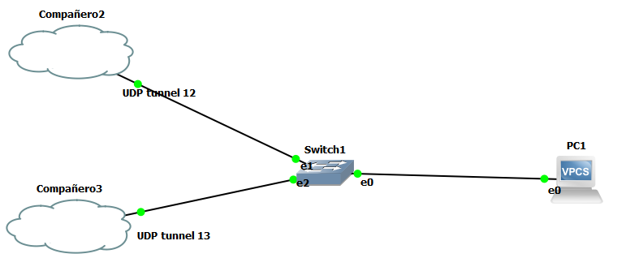
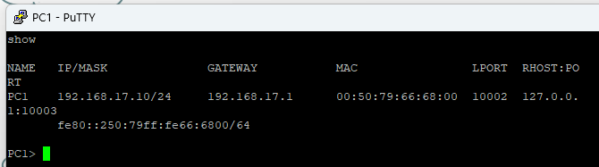
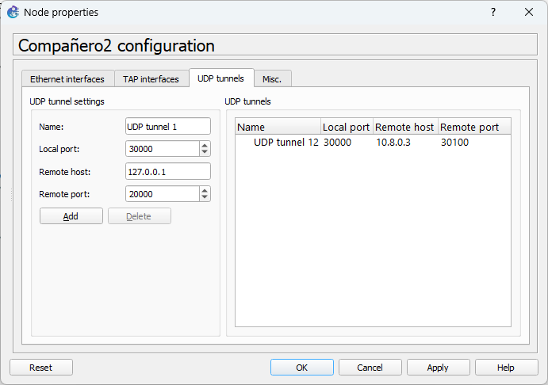
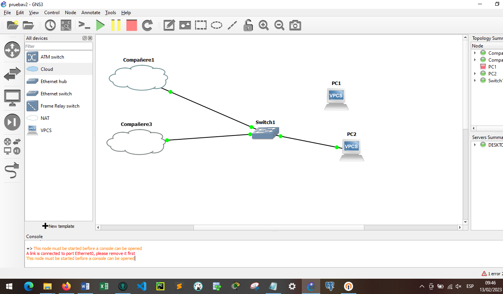
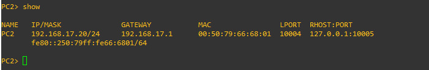
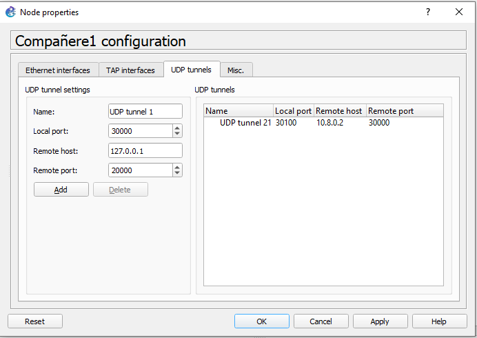
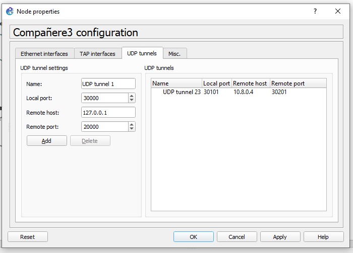
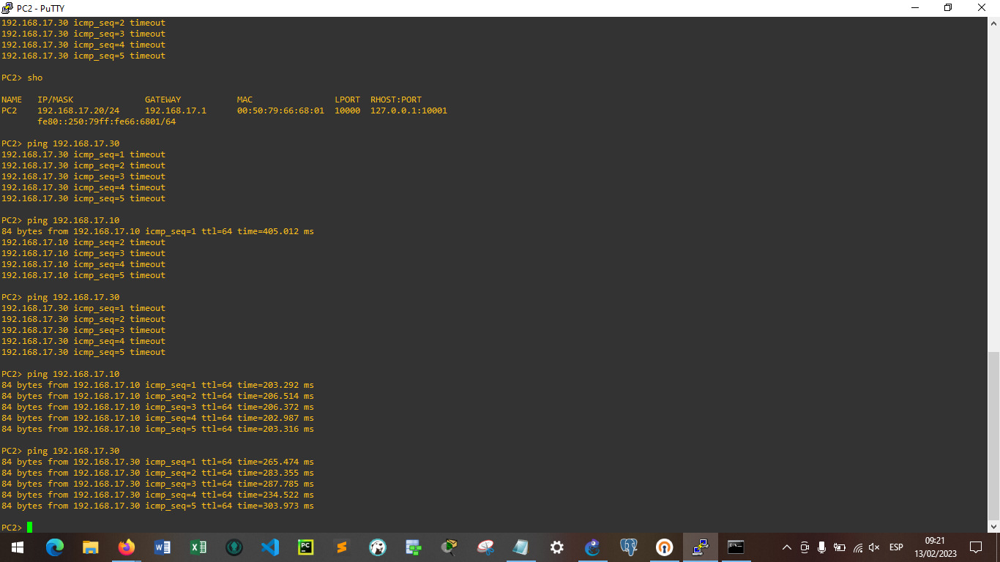

## **COMPAÑERO 1 - 201807428**
---
Topología local.  

Configuración de la `VPC1`.  

Configuración de la `CLOUD` del compañero 2.

Configuración de la `CLOUD` del compañero 3.

Pings entre los hosts.

## **COMPAÑERO 2 - 201709528**
---
Topología local.  

Configuración de la `VPC1`.  

Configuración de la `CLOUD` del compañero 2.

Configuración de la `CLOUD` del compañero 3.

Pings entre los hosts.

