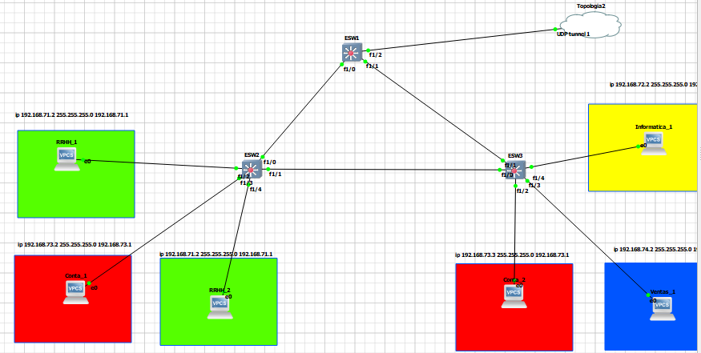
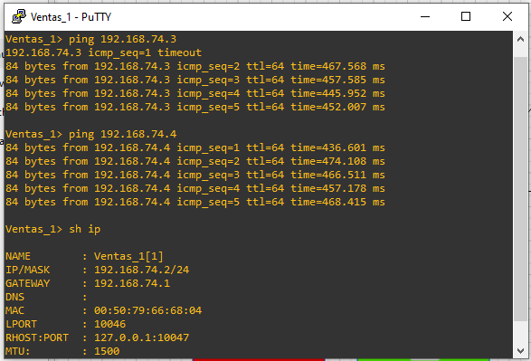
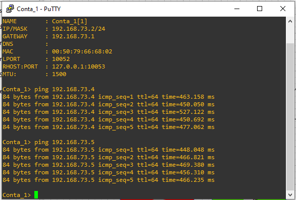
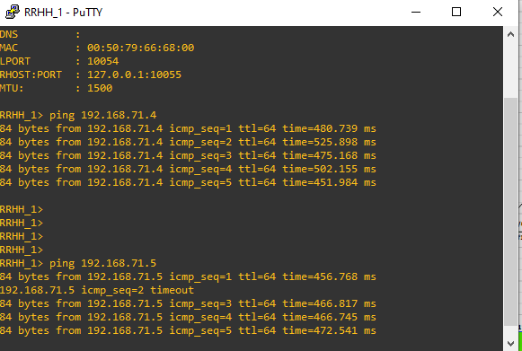
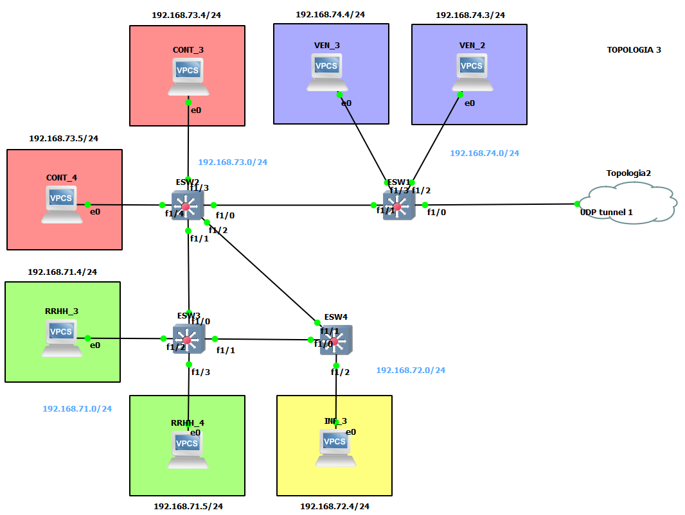
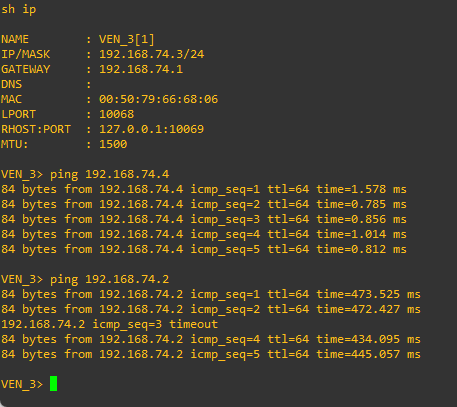
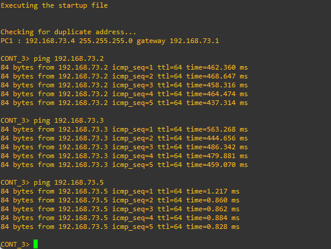
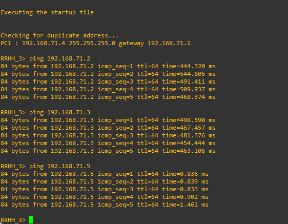
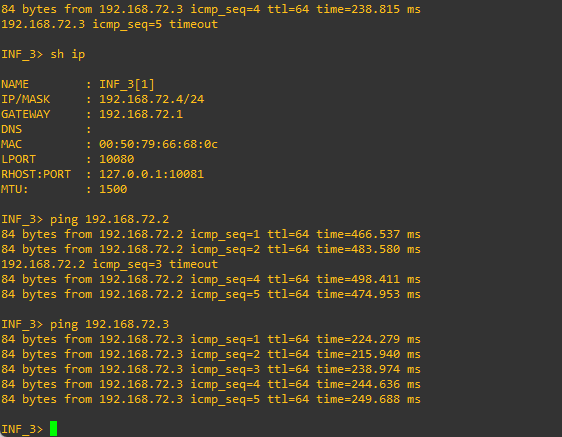

# **MANUAL TÉCNICO - GRUPO 7**
## **Integrantes**
| **CARNET** | **NOMBRE** | 
|:-: |:-- |
| 201807428 | Wilson Kevin Javier Chávez Cabrera |
| 201709528 | Danny Eduardo Cuxum Sánchez  |
| 201800534 | Brandon Oswaldo Yax Campos  |

## **INDICE**
- [**MANUAL TÉCNICO - GRUPO 7**](#manual-técnico---grupo-7)
  - [**Integrantes**](#integrantes)
  - [**INDICE**](#indice)
  - [**Tabla 1.0**](#tabla-10)
  - [**Area de Trabajo**](#area-de-trabajo)
    - [**Topología 1**](#topología-1)
  - [**Configuraciones**](#configuraciones)
      - [**ESW1**](#esw1)
      - [**ESW2**](#esw2)
      - [**ESW3**](#esw3)
      - [**VPC - RRHH\_1**](#vpc---rrhh_1)
      - [**VPC - RRHH\_2**](#vpc---rrhh_2)
      - [**VPC - Conta\_1**](#vpc---conta_1)
      - [**VPC - Conta\_2**](#vpc---conta_2)
      - [**VPC - Ventas\_1**](#vpc---ventas_1)
      - [**VPC - Informatica\_1**](#vpc---informatica_1)
    - [**Comprobaciones**](#comprobaciones)
  - [**Zona de Servidores**](#zona-de-servidores)
    - [**Topología**](#topología)
    - [**Configuraciones**](#configuraciones-1)
      - [**ESW1**](#esw1-1)
      - [**ESW2**](#esw2-1)
      - [**ESW3**](#esw3-1)
      - [**ESW4**](#esw4)
      - [**VPC - Ventas 2**](#vpc---ventas-2)
      - [**VPC - Ventas 3**](#vpc---ventas-3)
      - [**VPC - Contabilidad 3**](#vpc---contabilidad-3)
      - [**VPC - Contabilidad 4**](#vpc---contabilidad-4)
      - [**VPC - RRHHH 3**](#vpc---rrhhh-3)
      - [**VPC - RRHHH 4**](#vpc---rrhhh-4)
      - [**VPC - Informatica 3**](#vpc---informatica-3)
    - [**Comprobaciones**](#comprobaciones-1)
  - [Topología 2: Backbone](#topología-2-backbone)
    - [Topologia](#topologia)
    - [**Configuraciones**](#configuraciones-2)
      - [**ESW4**](#esw4-1)
      - [**ESW5**](#esw5)
      - [**ESW6**](#esw6)
      - [**ESW7**](#esw7)
      - [VPC Informatica 2](#vpc-informatica-2)
    - [Comprobaciones](#comprobaciones-2)

## **Tabla 1.0**
| **VLAN** | **#VLAN** | **Dirección de Red** | **Gateway** |
| :-- | :-- | :-- |:-- |
| RRHH | 10 | 192.168.71.0/24 | 192.168.71.1 |
| Informatica | 20 | 192.168.72.0/24 | 192.168.72.1 |
| Contabilidad | 30 | 192.168.73.0/24 | 192.168.73.1 |
| Ventas | 40 | 192.168.74.0/24 | 192.168.74.1 |

## **Area de Trabajo**
### **Topología 1**
La estructura de red que se utiliza para conectar los servidores web se llama topología, pero debido a que estos servidores están siempre activos, esta estructura puede ser muy pesada para manejar. Para abordar este problema, se implementa una configuración especial llamada "nodo maestro-esclavo" que ayuda a distribuir la carga de trabajo entre los servidores de manera equilibrada.

## **Configuraciones**
#### **ESW1**
- Configuración VTP.

    ~~~bash
    conf t
    vtp domain GRUPO7
    vtp password grupo7
    vtp version 2
    vtp mode client
    end
    ~~~

- Configuración de puertos (TRUNK/ACCESS).

    ~~~bash
    conf t
    int f1/0
    switchport mode trunk
    switchport trunk allowed vlan 1,10,20,30,40,1002-1005
    int f1/1
    switchport mode trunk
    switchport trunk allowed vlan 1,10,20,30,40,1002-1005
    int f1/2
    switchport mode trunk
    switchport trunk allowed vlan 1,10,20,30,40,1002-1005
    end
    ~~~

- Guardar configuración.

    ~~~bash
    copy running-config startup-config
    ~~~

- Verificar configuraciones.

    ~~~bash
    sh int tr
    sh vtp status
    sh vlan-sw
    sh spanning-tree brief
    ~~~
#### **ESW2**
- Configuración VTP.

    ~~~bash
    conf t
    vtp domain GRUPO7
    vtp password grupo7
    vtp version 2
    vtp mode client
    end
    ~~~

- Configuración de puertos (TRUNK/ACCESS).

    ~~~bash
    conf t
    int f1/0
    switchport mode trunk
    switchport trunk allowed vlan 1,10,20,30,40,1002-1005
    int f1/1
    switchport mode trunk
    switchport trunk allowed vlan 1,10,20,30,40,1002-1005
    int f1/2
    switchport mode access
    switchport access vlan 10
    int f1/4
    switchport mode access
    switchport access vlan 10
    int f1/3
    switchport mode access
    switchport access vlan 30
    end
    ~~~

- Guardar configuración.

    ~~~bash
    copy running-config startup-config
    ~~~

- Verificar configuraciones.

    ~~~bash
    sh int tr
    sh vtp status
    sh vlan-sw
    sh spanning-tree brief
    ~~~

#### **ESW3**
- Configuración VTP.

    ~~~bash
    conf t
    vtp domain GRUPO7
    vtp password grupo7
    vtp version 2
    vtp mode client
    end
    ~~~

- Configuración de puertos (TRUNK/ACCESS).

    ~~~bash
    conf t
    int f1/0
    switchport mode trunk
    switchport trunk allowed vlan 1,10,20,30,40,1002-1005
    int f1/1
    switchport mode trunk
    switchport trunk allowed vlan 1,10,20,30,40,1002-1005
    int f1/2
    switchport mode access
    switchport access vlan 30
    int f1/3
    switchport mode access
    switchport access vlan 40
    int f1/4
    switchport mode access
    switchport access vlan 20
    end
    ~~~

- Guardar configuración.

    ~~~bash
    copy running-config startup-config
    ~~~

- Verificar configuraciones.

    ~~~bash
    sh int tr
    sh vtp status
    sh vlan-sw
    sh spanning-tree brief
    ~~~

#### **VPC - RRHH_1**
- Configurar IP, MAC, GATEAWAY.

    ~~~bash
    ip 192.168.71.2 255.255.255.0 192.168.71.1
    save
    sh ip
    ~~~

#### **VPC - RRHH_2**
- Configurar IP, MAC, GATEAWAY.

    ~~~bash
    ip 192.168.71.3 255.255.255.0 192.168.71.1
    save
    sh ip
    ~~~

#### **VPC - Conta_1**
- Configurar IP, MAC, GATEAWAY.

    ~~~bash
    ip 192.168.73.2 255.255.255.0 192.168.73.1
    save
    sh ip
    ~~~

#### **VPC - Conta_2**
- Configurar IP, MAC, GATEAWAY.

    ~~~bash
    ip 192.168.73.3 255.255.255.0 192.168.73.1
    save
    sh ip
    ~~~

#### **VPC - Ventas_1**
- Configurar IP, MAC, GATEAWAY.

    ~~~bash
    ip 192.168.74.2 255.255.255.0 192.168.74.1
    save
    sh ip
    ~~~

#### **VPC - Informatica_1**
- Configurar IP, MAC, GATEAWAY.

    ~~~bash
    ip 192.168.72.2 255.255.255.0 192.168.72.1
    save
    sh ip
    ~~~

### **Comprobaciones**
- Ventas

    

- Contabilidad

    

- RRHH

    

- Informatica

    

## **Zona de Servidores**
### **Topología**
Esta topología se utiliza para la conexión de los servidores web de la empresa. Dado que estos servidores están siempre activos, esta topología se vuelve extremadamente pesada. Por lo que se implementa un nodo maestro-esclavo para equilibrar la carga del mismo.

### **Configuraciones**
#### **ESW1**
- Configuración VTP.

    ~~~bash
    conf t
    vtp domain GRUPO7
    vtp password grupo7
    vtp version 2
    vtp mode client
    end
    ~~~

- Configuración de puertos (TRUNK/ACCESS).

    ~~~bash
    conf t
    int f1/0
    switchport mode trunk
    switchport trunk allowed vlan 1,10,20,30,40,1002-1005
    int f1/1
    switchport mode trunk
    switchport trunk allowed vlan 1,10,20,30,40,1002-1005
    int f1/2
    switchport mode access
    switchport access vlan 40
    int f1/3
    switchport mode access
    switchport access vlan 40
    end
    ~~~

- Guardar configuración.

    ~~~bash
    copy running-config startup-config
    ~~~

- Verificar configuraciones.

    ~~~bash
    sh int tr
    sh vtp status
    sh vlan-sw
    sh spanning-tree brief
    ~~~

#### **ESW2**
- Configuración VTP.

    ~~~bash
    conf t
    vtp domain GRUPO7
    vtp password grupo7
    vtp version 2
    vtp mode client
    end
    ~~~

- Configuración de puertos (TRUNK/ACCESS).

    ~~~bash
    conf t
    int f1/0
    switchport mode trunk
    switchport trunk allowed vlan 1,10,20,30,40,1002-1005
    int f1/1
    switchport mode trunk
    switchport trunk allowed vlan 1,10,20,30,40,1002-1005
    int f1/2
    switchport mode trunk
    switchport trunk allowed vlan 1,10,20,30,40,1002-1005
    int f1/3
    switchport mode access
    switchport access vlan 30
    int f1/4
    switchport mode access
    switchport access vlan 30
    end
    ~~~

- Guardar configuración.

    ~~~bash
    copy running-config startup-config
    ~~~

- Verificar configuraciones.

    ~~~bash
    sh int tr
    sh vtp status
    sh vlan-sw
    sh spanning-tree brief
    ~~~

#### **ESW3**
- Configuración VTP.

    ~~~bash
    conf t
    vtp domain GRUPO7
    vtp password grupo7
    vtp version 2
    vtp mode client
    end
    ~~~

- Configuración de puertos (TRUNK/ACCESS).

    ~~~bash
    conf t
    int f1/0
    switchport mode trunk
    switchport trunk allowed vlan 1,10,20,30,40,1002-1005
    int f1/1
    switchport mode trunk
    switchport trunk allowed vlan 1,10,20,30,40,1002-1005
    int f1/2
    switchport mode access
    switchport access vlan 10
    int f1/3
    switchport mode access
    switchport access vlan 10
    end
    ~~~

- Guardar configuración.

    ~~~bash
    copy running-config startup-config
    ~~~

- Verificar configuraciones.

    ~~~bash
    sh int tr
    sh vtp status
    sh vlan-sw
    sh spanning-tree brief
    ~~~

#### **ESW4**
- Configuración VTP.

    ~~~bash
    conf t
    vtp domain GRUPO7
    vtp password grupo7
    vtp version 2
    vtp mode transparent
    end
    ~~~

- Configuración de puertos (TRUNK/ACCESS).

    ~~~bash
    conf t
    int f1/0
    switchport mode trunk
    switchport trunk allowed vlan 1,10,20,30,40,1002-1005
    int f1/1
    switchport mode trunk
    switchport trunk allowed vlan 1,10,20,30,40,1002-1005
    int f1/2
    switchport mode access
    switchport access vlan 20
    end
    ~~~

- Guardar configuración.

    ~~~bash
    copy running-config startup-config
    ~~~

- Verificar configuraciones.

    ~~~bash
    sh int tr
    sh vtp status
    sh vlan-sw
    sh spanning-tree brief
    ~~~

#### **VPC - Ventas 2**
- Configurar IP, MAC, GATEAWAY.

    ~~~bash
    ip 192.168.74.3/24 192.168.74.1
    save
    sh ip
    ~~~

#### **VPC - Ventas 3**
- Configurar IP, MAC, GATEAWAY.

    ~~~bash
    ip 192.168.74.4/24 192.168.74.1
    save
    sh ip
    ~~~

#### **VPC - Contabilidad 3**
- Configurar IP, MAC, GATEAWAY.

    ~~~bash
    ip 192.168.73.4/24 192.168.73.1
    save
    sh ip
    ~~~

#### **VPC - Contabilidad 4**
- Configurar IP, MAC, GATEAWAY.

    ~~~bash
    ip 192.168.73.5/24 192.168.73.1
    save
    sh ip
    ~~~

#### **VPC - RRHHH 3**
- Configurar IP, MAC, GATEAWAY.

    ~~~bash
    ip 192.168.71.4/24 192.168.71.1
    save
    sh ip
    ~~~

#### **VPC - RRHHH 4**
- Configurar IP, MAC, GATEAWAY.

    ~~~bash
    ip 192.168.71.5/24 192.168.71.1
    save
    sh ip
    ~~~

#### **VPC - Informatica 3**
- Configurar IP, MAC, GATEAWAY.

    ~~~bash
    ip 192.168.72.4/24 192.168.72.1
    save
    sh ip
    ~~~

### **Comprobaciones**
- Ventas

    

- Contabilidad

    

- RRHH

    

- Informatica

    

## Topología 2: Backbone
Zona encargada de conectar y administrar el área de trabajo con la zona de servidores, teniendo nodos altamente redundantes cuya finalidad fue brindar una conectividad el 100% del tiempo.

### Topologia

### **Configuraciones**
#### **ESW4**

- Creacion Vlans

    ~~~bash
    conf t
    vlan 10
    name RRHH
    exit
     vlan 20
    name Informatica
    exit
    vlan 30
    name Contabilidad
    exit
    vlan 40
    name Ventas
    exit
    ~~~

- Configuración Trunks
    ~~~bash
    conf t
    int f1/1
    switchport mode trunk
    switchport trunk allowed vlan 1,10,20,30,40,1002-1005
    int f1/2
    switchport mode trunk
    switchport trunk allowed vlan 1,10,20,30,40,1002-1005
    int f1/0
    switchport mode trunk
    switchport trunk allowed vlan 1,10,20,30,40,1002-1005
    ~~~

- Configuración Vtp
    ~~~bash
        conf t
        vtp domain GRUPO7
        vtp password grupo7
        vtp version 2
        vtp mode server
        end
        sh vtp status
    ~~~

- Root Bridge
    ~~~bash
        conf t
        spanning-tree vlan 1 root primary
        spanning-tree vlan 10 root primary
        spanning-tree vlan 20 root primary
        spanning-tree vlan 30 root primary
        spanning-tree vlan 40 root primary
    ~~~

#### **ESW5**

- Configuración Trunks
    ~~~bash
    conf t
    int f1/1
    switchport mode trunk
    switchport trunk allowed vlan 1,10,20,30,40,1002-1005
    int f1/2
    switchport mode trunk
    switchport trunk allowed vlan 1,10,20,30,40,1002-1005
    int f1/3
    switchport mode trunk
    switchport trunk allowed vlan 1,10,20,30,40,1002-1005
    int f1/0
    switchport mode access
    switchport access vlan 20
    ~~~

- Configuración Vtp
    ~~~bash
    conf t
    vtp domain GRUPO7
    vtp password grupo7
    vtp version 2
    vtp mode client
    end
    sh vtp status
    ~~~

#### **ESW6**

- Configuración Trunks
  
    ~~~bash
    conf t
    int f1/0
    switchport mode trunk
    switchport trunk allowed vlan 1,10,20,30,40,1002-1005
    int f1/1
    switchport mode trunk
    switchport trunk allowed vlan 1,10,20,30,40,1002-1005
    ~~~

- Configuración Vtp
    ~~~bash
    conf t
    vtp domain GRUPO7
    vtp password grupo7
    vtp version 2
    vtp mode client
    end
    sh vtp status
    ~~~

#### **ESW7**

- Configuración Trunks
    ~~~bash
    conf t
    int f1/1
    switchport mode trunk
    switchport trunk allowed vlan 1,10,20,30,40,1002-1005
    int f1/2
    switchport mode trunk
    switchport trunk allowed vlan 1,10,20,30,40,1002-1005
    int f1/0
    switchport mode trunk
    switchport trunk allowed vlan 1,10,20,30,40,1002-1005
    int f1/3
    switchport mode trunk
    switchport trunk allowed vlan 1,10,20,30,40,1002-1005
    ~~~

- Configuración Vtp
    ~~~bash
    conf t
    vtp domain GRUPO7
    vtp password grupo7
    vtp version 2
    vtp mode client
    end
    sh vtp status
    ~~~
#### VPC Informatica 2
- Configuración Ip
    ~~~bash
    ip 192.168.72.3 255.255.255.0 192.168.72.1
    save
    ~~~
### Comprobaciones

